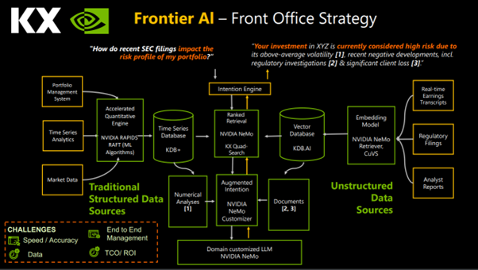

# KX NVIDIA MULTIMODAL RAG

## Architecture

We are planning to implement a similar architecture using both structured and unstructured data with database provided by KX and the NVIDIA AI software stack:

 



## How is it a differentiator in modern GenAI arena?

This architecture is an advanced depiction of processing domain specific data through modern high-end GPU’s (as compared to orthodox CPU setup), along-side customizing and fine-tuning the ML models and LLM’s according to individual/firm-based demand, thus providing unmatched performance and accuracy which is not possible through the generic models available in the market.
While plethora of implementations include processing of small sets of data and documents which might not be relevant to any particular industry and preforming a simple Q&A over the same, we have been able to demonstrate an Advanced RAG application capable of creating and ingesting vector embeddings from over 2 million documents into the KDB.AI vector DB.
Utilizing the latest LLM models like Llama-3.1 8B and 70B models as well as enriching them with the most advanced NVIDIA technology suite, our application has been able to provide most accurate and interactive answers to complex user queries all based on the ingested dataset which makes the results highly relevant and specific to the domain requirements.
All of the above are packed with performance as they maximize the use of the latest and most advanced NVIDIA GPU’s which are aided by NVIDIA software stack of NeMO Retriever, RAPIDS, Nemo Customizer and NIM LLM’s to deliver a seamless experience in terms of time for retrieval and generation of results which is beyond comparison and provides a massive boost to get customers far ahead of any competitors leveraging the above.
Clearly it provides a cutting edge and is the need of the hour in the growing AI industry and drastically proves to be a game-changer when considering a futuristic view migrating from the existing legacy CPU based architecture to the modern and advanced GPU based workflow utilizing our KDB.AI vector DB alongside NVIDIA technology stack.


 
## Workflow

It includes flow of 2 different types of data being processed:
1.	Structured Data (Time series market and financial data flowing into KDB+ Time Series DB)
2.	Unstructured Data (Documents, Text, Images flowing into in the KDB.AI Vector DB)

### Data Ingestion:
Both the structured and unstructured data are ingested into the respective DB’s using NVIDIA RAPIDS, while for Data Loading & ETL for structured data we use cuDF and Apache Spark alongside RAFT for ML based analysys, the vector DB utilizes cuVS from the RAPIDS framework.
For any Graph analytics along side model training and fine-tuning for ML and deep learning, we utilize the cuML, cuGraph and Apache Spark ML Accelarator.


RAPIDS makes accelerated computing more seamless while enabling specialization for lightning-fast end-to-end performance on GPU’s which is almost 70 times faster than a similar CPU Configuration with parallel operation over thousands of threads as required and hence massively boosting our process computation and performance.

### Embedding Creation:
For the unstructured data, we use the NVIDIA NeMo Retriever Embedding NIM microservices and leverage the NV-EmbedQA-E5-v5 embedding model to encode and create vector embeddings from the documents, text, images and reports and store into the KDB.AI vector DB.


 


These microservices are built on top of CUDA, NVIDIA TensorRT, NVIDIA Triton Inference Server, and many other SDKs from the NVIDIA software suite to maximize ease of use, reliability, and performance.


### Deploying and using LLMs:
Using the NIM LLM Microservice we have deployed Llama-3 as well as Llama-3.1 8B and 70B models to be used for the Advanced RAG application.


### Fine-Tune and Align LLMs:
As large language models (LLMs) continue to gain traction in enterprise AI applications, the demand for custom models that can understand and integrate specific industry terminology, domain expertise, and unique organizational requirements has become increasingly important. To achieve the same we have used NeMo Customizer which is a high-performance, scalable microservice that simplifies the fine tuning and alignment of our LLM’s.
Using two of the popular parameter-efficient fine-tuning (PEFT) techniques, low-rank adaptation (LoRA) and P-tuning, it accelerates the training performance using parallelism techniques, and scales to multi-GPU and multinodes. We have used the same to fine tune our Llama-3 as well as Llama-3.1 8B & 70B and Mixtral 8x22b LLM’s for our domain-specific use-cases.


 

### Advanced RAG Application - KX Assistant:

                   

•	Using the NIM (Llama 3/Mixtral) LLM fine-tuned with NeMo Customizer, performed Advanced RAG usage for Q&A.
•	Embeddings from 2 million documents from financial markets related to trading using NeMO Retriever NV-EmbedQA-E5-v5 embedding model.
•	The creation of embeddings and the ingestion was completed in 1 hour 20 mins using NVIDIA Rapids & KDB.AI in comparison to 40+ hours on CPU.
•	100% GPU utilization of the NVIDIA GH 200 GPU.
•	Reduced power consumption of only 298 W out of 900 W (33% usage).


### KX Assistant - Interactive RAG


       

	In screen 1, the query is sent to KDB.AI for generating Alpha for trading, which processes the results from embeddings generated from 2M+ documents and gives the user an interactive option to proceed with the suggestions and all of this is done within a matter of few secs with the power of KDB.AI and NVIDIA GPU/Software.
	In screen 2, we can see the advanced RAG flow processing the results based on the option selected keeping the GPU utilized at 100%.
	In screen 3, we see that all the results and summary is generated in the end marking the end of the flow.

 
## NVIDIA AI Software Stack

### NeMo Retriever

NeMo Retriever is a part of the Nvidia Nemo platform, which is a suite of AI models and tools designed to accelerate and simplify various tasks in natural language processing (NLP), computer vision, and other areas of AI research.
Specifically, Nemo Retriever is a GPU-accelerated retrieval model that enables efficient and accurate retrieval of relevant information from large datasets or knowledge bases. It's designed to help AI models and applications quickly find and retrieve relevant information, such as text passages, images, or other types of data, based on a given query or prompt.
Nemo Retriever uses a combination of neural networks and indexing techniques to achieve fast and accurate retrieval. It's particularly useful in applications such as question answering, text classification, and information retrieval, where rapid access to relevant information is critical. Some key benefits of Nemo Retriever include speed, accuracy and scalability with potential use cases such as Virtual Assistants, Search Engine, Chatbots and Knowledge Graph applications.

### NVIDIA RAPIDS, CUVS, RAFT
NVIDIA Rapids is an open-source software framework developed by Nvidia that enables data scientists and engineers to accelerate their data science and machine learning workflows using NVIDIA GPUs. Rapids is designed to provide a seamless and efficient way to process and analyze large datasets, leveraging the parallel processing capabilities of NVIDIA GPUs.
Rapids is built on top of the CUDA programming model and provides a set of libraries and tools that allow users to accelerate various stages of the data science workflow, including data ingestion, data processing, ML and data visualization. It provides a Python API, making it easy to integrate with popular data science libraries and frameworks, such as Pandas, NumPy, and scikit-learn.
Key benefits are accelerated performance, scalability and ease of use. It is widely applied to various industries including finance, healthcare, retail and scientific research.


CUVS (CUDA Unified Virtualized Scheduler) is a component of the Rapids ecosystem, which is an open-source software platform for accelerating data science and machine learning workloads on NVIDIA GPUs. CUVS is a scheduler that enables multiple processes to share the same GPU, improving GPU utilization and reducing the overhead of context switching between different processes. 
It provides a unified scheduling mechanism for CUDA, cuDNN, and other NVIDIA libraries, allowing multiple applications to share the GPU without the need for explicit synchronization or coordination which is achieved by virtualizing the CPUs, scheduling workloads and managing memory. It includes other tools and libraries like cuDF, cuML, and cuGraph, all designed to accelerate the GPUs.


RAFT (Reusable Accelerated Functions and Tools) contains fundamental widely-used algorithms and primitives for machine learning and information retrieval. The algorithms are CUDA-accelerated and form building blocks for more easily writing high performance applications. It accelerates the algorithm construction time, reduces the maintenance burden by maximizing reuse across projects, and centralizes core reusable computations, allowing future optimizations to benefit all algorithms that use them.
Raft is used as the consensus algorithm for distributed training and inference in machine learning and deep learning applications. This allows to scale to large clusters of GPUs and ensure that the system remains available and fault-tolerant even in the presence of node failures.

### NeMo Customizer
NeMo Customizer is an end-to-end platform for developing custom generative AI includes tools for training, fine-tuning, retrieval-augmented generation (RAG), guardrailing, and data curation, along with pretrained models. It has offerings across the tech stack, from frameworks to higher-level API endpoints.
Built on top of the NeMo framework it provides the easiest path for enterprises to get started with fine-tuning LLMs, thereby facilitating a fast, cost-effective way to adopt generative AI. NeMo Customizer simplifies LLM customization by leveraging the quickly deployable microservices, accelerates training performance using parallelism techniques, and scales to multi-GPU and multinodes. Benefits include faster time to market, accelerated performance and scalability.

### NVIDIA NIM for LLMs
NVIDIA NIM (NVIDIA Inference Manager) is a software development kit (SDK) designed to optimize and manage AI inference workloads on NVIDIA GPUs. It provides a set of tools and APIs that enable developers to deploy, manage, and optimize AI models on NVIDIA hardware, ensuring efficient and scalable inference performance.
NIM is part of the NVIDIA TensorRT (Tensor Runtime) platform, which is a software development kit for high-performance AI inference NIM provides several key features to optimize AI inference workloads, including model optimization, model management, interference engine, resource management and scalability.
NVIDIA NIM for large language models (LLMs) brings the power of state-of-the-art LLMs to enterprise applications, providing unmatched natural language processing and understanding capabilities. It provides high performance features like scalable deployment, advanced language model, flexible integration and enterprise grade security.

 
## Setup

We have created the advanced RAG notebook and application while going through all the below steps:
•	Hardware used in RAG – NVIDIA H100 8-way GPU server
•	Pre-requisites
•	CUDA Toolkit
•	CUDA Drivers
•	Define Environment Variables
•	NVIDIA Persistence Daemon (nvidia-smi)
•	NVIDIA Fabric Manager for NV Switch and NV Link
•	NVIDIA Container Toolkit
•	Docker Installation & Configuration
•	NGC CLI Toolkit and Configuration
•	NIM Llama3 8b Container Deployment
•	NIM Llama3 70b Container Deployment
•	NeMo Retriver Mistral 7b model Deployment
•	Python & Streamlit modules Installation
•	NV Dashboards
•	KX Assistant RAG Application
•	Chatbot/Q&A Application integrated with NIM Llama3 8b and Llama3 70b
 
### Setup steps for the KX RAG with RAPIDS/NeMo/NIM

#### Verify Components (on Local Machine to test readiness)

Commands:

```bash
ld -v  (should be >= 2.35)
GNU ld (GNU Binutils for Ubuntu) 2.38
lspci | grep -i nvidia  (to verify CUDA capable GPU)
05:00.0 Bridge: NVIDIA Corporation Device 22a3 (rev a1)
..
e4:00.0 3D controller: NVIDIA Corporation Device 2330 (rev a1)
uname -m && cat /etc/*release  (to verify supported version of Linux)
x86_64
..
DISTRIB_DESCRIPTION="Ubuntu 22.04.4 LTS"
gcc --version  (verify gcc version)
gcc (Ubuntu 11.4.0-1ubuntu1~22.04) 11.4.0
uname -r  (verify kernel version)
5.15.0-122-generic
```

#### Install CUDA Toolkit

Link:
https://developer.nvidia.com/cuda-downloads?target_os=Linux&target_arch=x86_64&Distribution=Ubuntu&target_version=22.04&target_type=deb_local

Commands:
```bash
wget https://developer.download.nvidia.com/compute/cuda/repos/ubuntu2204/x86_64/cuda-ubuntu2204.pin
sudo mv cuda-ubuntu2204.pin /etc/apt/preferences.d/cuda-repository-pin-600
wget https://developer.download.nvidia.com/compute/cuda/12.6.2/local_installers/cuda-repo-ubuntu2204-12-6-local_12.6.2-560.35.03-1_amd64.deb
sudo dpkg -i cuda-repo-ubuntu2204-12-6-local_12.6.2-560.35.03-1_amd64.deb
sudo cp /var/cuda-repo-ubuntu2204-12-6-local/cuda-*-keyring.gpg /usr/share/keyrings/
sudo apt-get update
sudo apt-get -y install cuda-toolkit-12-6
md5sum cuda-repo-ubuntu2204-12-6-local_12.6.2-560.35.03-1_amd64.deb (Check downloaded file)
081bce9e80ff0609b54c55dbaaea778d cuda-repo-ubuntu2204-12-6-local_12.6.2-560.35.03-1_amd64.deb
```

#### Install CUDA Driver

Link:
https://docs.nvidia.com/cuda/cuda-installation-guide-linux/

Commands:
```bash
sudo apt-get install -y nvidia-open (for open module)
sudo apt-get install -y cuda-drivers (for legacy, opt for this)
sudo reboot
```

#### Define Environment Variables

Commands:
```bash
export PATH=/usr/local/cuda-12.5/bin${PATH:+:${PATH}}
export LD_LIBRARY_PATH=/usr/local/cuda-12.5/lib64${LD_LIBRARY_PATH:+:${LD_LIBRARY_PATH}}
cat /proc/driver/nvidia/version (to check driver version)
NVRM version: NVIDIA UNIX x86_64 Kernel Module  555.42.06  Tue Jun  4 00:59:30 UTC 2024
GCC version:  gcc version 11.4.0 (Ubuntu 11.4.0-1ubuntu1~22.04)
```


#### Nvidia Persistence Deamon
Link:
https://docs.nvidia.com/deploy/driver-persistence/index.html

Commands:
```bash
nvidia-persistenced --version  (check version)
/usr/bin/nvidia-persistenced --verbose  (to start daemon)
nvidia-smi -i <target gpu> -pm ENABLED  (to enable persistence mode using nvidia-smi (as root))
nvidia-smi -i <target gpu> - q  (to view current persistence mode using nvidia-smi)
nvidia-persistenced --user kxuser  (to run the NVIDIA Persistence Daemon, simply run (as root))
nvidia-smi -pm 0  (to disable persistence mode on all GPUs, simply run (as root)
nvidia-smi -pm 1  (to enable persistence mode on all GPUs, simply run (as root)
nvidia-persistenced --help  (man page for daemon)
nvidia-smi  (to check status of all GPU's)
```

#### Verify Cuda in Python

Commands:
```bash
Python
import torch
torch.cuda.is_available()  (returns True if working properly)
```


#### Verify CUDA through modules

Commands:
```bash
git clone https://github.com/NVIDIA/cuda-samples.git
cd <location>/cuda-samples/Samples/1_Utilities/deviceQuery
make
./deviceQuery  (return a proper list of all GPU devices if passes)
sudo setenforce 0  (if some system error comes in running the command)
cd <location>/cuda-samples/Samples/1_Utilities/bandwidthTest
make
./bandwidthTest  (returns bandwidth of transfer)
```
#### NVSwitch and NVLink Machines Setup - Fabric Manager
Link:
https://docs.nvidia.com/datacenter/tesla/pdf/fabric-manager-user-guide.pdf

Commands:
```bash
nvidia-smi -q -i 0 | grep -i -A 2 Fabric
(returns In Progress State and N/A Status if the GPU's have NVSwitch but are not connected)
(returns Completed State and Success Status if the GPU's have NVSwitch and not connected)
sudo apt-get install cuda-drivers-fabricmanager-560
sudo systemctl start nvidia-fabricmanager   (to start FM)
sudo systemctl stop nvidia-fabricmanager    (to stop FM)
sudo systemctl status nvidia-fabricmanager  (for FM status)
sudo systemctl enable nvidia-fabricmanager  (enable autostart FM at boot)
sudo systemctl disable nvidia-fabricmanager (disable autostart FM at boot)
sudo journalctl -u nvidia-fabricmanager     (to check the FM system log messages)
```

#### Install Docker
Link:
https://docs.docker.com/engine/install/ubuntu/

Commands:
```bash
#Remove older versions
for pkg in docker.io docker-doc docker-compose docker-compose-v2 podman-docker containerd runc; do sudo apt-get remove $pkg; done
#Add Docker's official GPG key:
sudo apt-get update
sudo apt-get install ca-certificates curl
sudo install -m 0755 -d /etc/apt/keyrings
sudo curl -fsSL https://download.docker.com/linux/ubuntu/gpg -o /etc/apt/keyrings/docker.asc
sudo chmod a+r /etc/apt/keyrings/docker.asc
#Add the repository to Apt sources
echo \
  "deb [arch=$(dpkg --print-architecture) signed-by=/etc/apt/keyrings/docker.asc] https://download.docker.com/linux/ubuntu \
  $(. /etc/os-release && echo "$VERSION_CODENAME") stable" | \
  sudo tee /etc/apt/sources.list.d/docker.list > /dev/null
sudo apt-get update
#Install latest version
sudo apt-get install docker-ce docker-ce-cli containerd.io docker-buildx-plugin docker-compose-plugin
#Verify Docker Engine installation-guide-linux/
sudo docker run hello-world
```


#### Post Installation Steps for Docker
Link:
https://docs.docker.com/engine/install/linux-postinstall/

Commands:
```bash
#Post installation steps to run docker without sudo
sudo groupadd docker
sudo usermod -aG docker $USER
newgrp docker
docker run hello-world
#Configure docker to start on boot with system
sudo systemctl enable docker.service
sudo systemctl enable containerd.service

#### Install NVIDIA Container Toolkit
Link:
https://docs.nvidia.com/datacenter/cloud-native/container-toolkit/latest/install-guide.html#installing-the-nvidia-container-toolkit

Commands:
curl -fsSL https://nvidia.github.io/libnvidia-container/gpgkey | sudo gpg --dearmor -o /usr/share/keyrings/nvidia-container-toolkit-keyring.gpg \
  && curl -s -L https://nvidia.github.io/libnvidia-container/stable/deb/nvidia-container-toolkit.list | \
    sed 's#deb https://#deb [signed-by=/usr/share/keyrings/nvidia-container-toolkit-keyring.gpg] https://#g' | \
    sudo tee /etc/apt/sources.list.d/nvidia-container-toolkit.list
sudo apt-get update
sudo apt-get install -y nvidia-container-toolkit
```

#### Configure Docker
Link:
https://docs.nvidia.com/datacenter/cloud-native/container-toolkit/latest/install-guide.html#configuring-docker

Commands:
```bash
sudo nvidia-ctk runtime configure --runtime=docker
sudo systemctl restart docker
sudo docker run --rm --runtime=nvidia --gpus all ubuntu nvidia-smi  (as a verification it should return the nvidia-smi results on ubuntu)
```

#### Docker daemon and nvidia-smi Issue Fix

Commands:
```bash
sudo systemctl daemon-reload
sudo service docker restart
sudo nvidia-smi -pm 1
```

#### Docker Login to NGC
```bash
echo "$NGC_API_KEY" | sudo docker login nvcr.io --username '$oauthtoken' --password-stdin  (should return login succeeded)
```
#### Setup NGC CLI Toolkit
Link:
https://org.ngc.nvidia.com/setup/installers/cli


Commands:

```bash
wget --content-disposition https://api.ngc.nvidia.com/v2/resources/nvidia/ngc-apps/ngc_cli/versions/3.53.0/files/ngccli_linux.zip -O ngccli_linux.zip && unzip ngccli_linux.zip
find ngc-cli/ -type f -exec md5sum {} + | LC_ALL=C sort | md5sum -c ngc-cli.md5
sha256sum ngccli_linux.zip
mv ngc-cli.md5 ngccli_linux.zip ngc-cli /mnt/localdisk/kxuser/dl/
chmod u+x ngc-cli/ngc
echo "export PATH=\"\$PATH:$(pwd)/ngc-cli\"" >> ~/.bash_profile && source ~/.bash_profile
```

#### Set NGC Config
Link:
https://docs.ngc.nvidia.com/cli/cmd.html

Commands:
```bash
ngc config set
Enter API key [****MmE2]. Choices: [<VALID_APIKEY>, 'no-apikey']: <Enter API KEY>
Enter CLI output format type [ascii]. Choices: ['ascii', 'csv', 'json']: ascii
Enter org [no-org]. Choices: ['pramamoorthy@nvidia (0556952895524917)', 'NV-Developer (b7z2uzy5hmfb)', 'LLM_EA_NV (bwbg3fjn7she)', 'nv-npn', 'nemo-microservice (ohlfw0olaadg)']: LLM_EA_NV (bwbg3fjn7she)
Enter team [no-team]. Choices: ['no-team']:
Enter ace [no-ace]. Choices: ['no-ace']:
ngc config current
```

#### Deploy NIM – LLM – Llama3.1 70B
Links:
https://docs.nvidia.com/nim/large-language-models/latest/getting-started.html

https://build.nvidia.com/meta/llama-3_1-70b-instruct?snippet_tab=Docker

```bash
#Check available Llama3 Models
ngc registry image list --format_type csv nvcr.io/nim/*
#Install and Run Llama3.1-70b-instruct
export NGC_API_KEY=<PASTE_API_KEY_HERE>
echo "$NGC_API_KEY" | sudo docker login nvcr.io --username '$oauthtoken' --password-stdin 
export LOCAL_NIM_CACHE=~/.cache/nim
mkdir -p "$LOCAL_NIM_CACHE"
docker run -it --rm \
    --gpus all \
    --shm-size=16GB \
    -e NGC_API_KEY \
    -v "$LOCAL_NIM_CACHE:/opt/nim/.cache" \
    -u $(id -u) \
    -p 8000:8000 \
    nvcr.io/nim/meta/llama-3.1-70b-instruct:latest
#Verify successful run
curl -s http://0.0.0.0:8000/v1/models | jq
```

#### Deploy NeMo Retriever – Embedding – Embed QA E5 V5
Links:

https://docs.nvidia.com/nim/nemo-retriever/text-embedding/latest/getting-started.html

https://build.nvidia.com/nvidia/nv-embedqa-e5-v5?snippet_tab=Docker
```bash
#Check available Embedding Models
ngc registry image list --format_type csv nvcr.io/nim/meta/*embed*
#Install and Run Embed QA E5 V5
export NGC_API_KEY=<PASTE_API_KEY_HERE>
echo "$NGC_API_KEY" | sudo docker login nvcr.io --username '$oauthtoken' --password-stdin 
export LOCAL_NIM_CACHE=~/.cache/nim
mkdir -p "$LOCAL_NIM_CACHE"

docker run -it --rm \
    --gpus all \
    --shm-size=16GB \
    -e NGC_API_KEY \
    -v "$LOCAL_NIM_CACHE:/opt/nim/.cache" \
    -u $(id -u) \
    -p 8001:8000 \
    nvcr.io/nim/nvidia/nv-embedqa-e5-v5:1.1.0
#Verify successfull run
curl -s http://0.0.0.0:8001/v1/models | jq
```

There are additional deployment of the applications and use-cases.

 
#### Other Useful Links

•	https://developer.nvidia.com/blog/translate-your-enterprise-data-into-actionable-insights-with-nvidia-nemo-retriever/
•	https://rapids.ai/
•	https://rapids.ai/cuvs
•	https://rapids.ai/raft
•	https://github.com/rapidsai
•	https://github.com/rapidsai-community/notebooks-contrib
•	https://developer.nvidia.com/blog/fine-tune-and-align-llms-easily-with-nvidia-nemo-customizer/
•	https://docs.nvidia.com/nim/large-language-models/latest/introduction.html
•	https://docs.nvidia.com/nim/large-language-models/latest/getting-started.html
•	https://docs.nvidia.com/cuda/cuda-installation-guide-linux/
•	https://developer.nvidia.com/cuda-downloads
•	https://docs.nvidia.com/deploy/driver-persistence/index.html
•	https://docs.nvidia.com/datacenter/tesla/pdf/fabric-manager-user-guide.pdf
•	https://docs.docker.com/engine/install/ubuntu/
•	https://docs.docker.com/engine/install/linux-postinstall/
•	https://docs.nvidia.com/datacenter/cloud-native/container-toolkit/latest/install-guide.html
•	https://jupyterlab.readthedocs.io/en/stable/getting_started/installation.html
•	https://jupyterlab.readthedocs.io/en/stable/getting_started/starting.html
•	https://docs.ngc.nvidia.com/cli/cmd.html
•	https://org.ngc.nvidia.com/setup/installers/cli


